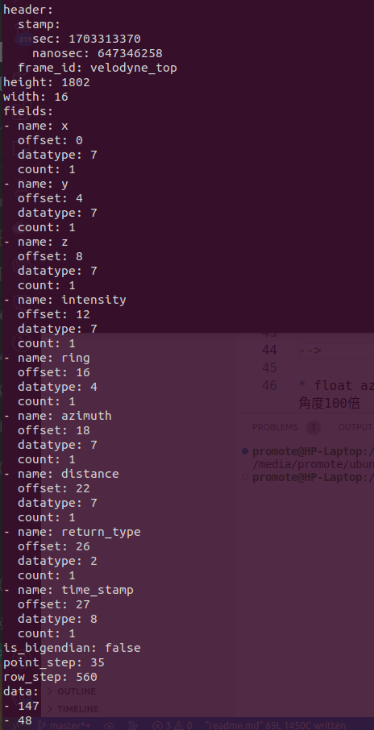

##  数据格式要求

```cpp

struct PointXYZIRADT
{
  PCL_ADD_POINT4D;
  float intensity;
  uint16_t ring = 0;

  float azimuth;
  float distance;
  uint8_t return_type;

  double time_stamp = 0;  //time_stamp
  EIGEN_MAKE_ALIGNED_OPERATOR_NEW
} EIGEN_ALIGN16;

POINT_CLOUD_REGISTER_POINT_STRUCT(
    PointXYZIRADT,
    (float, x, x)(float, y, y)(float, z, z)(float, intensity, intensity)
    (std::uint16_t, ring, ring)( float, azimuth, azimuth)
    (float, distance, distance)(std::uint8_t, return_type, return_type)
    (double, time_stamp, time_stamp))

```
<!--
``` cpp
struct PointXYZIRADT
{
  float x;
  float y;
  float z;

  float intensity;
  uint16_t ring = 0;

  float azimuth;
  float distance;
  uint8_t return_type;

  double time_stamp = 0;  //time_stamp
};
```
-->

* float azimuth: 数据范围 (0~36000.00), 实际角度100倍
* distance:   距离激光雷达,直线距离
* return_type : 最强回波反射
 


## Topic Publisher

`topic_name` 和 `frame_id` , 可以通过配置文件，自定义修改


## QSS 要求

```cpp
  pointcloud_pub = this->create_publisher<sensor_msgs::msg::PointCloud2>(
          topic_name, 
          rclcpp::SensorDataQoS().keep_last(5)
      );
```

<!--
pointcloud_pub = this->create_publisher<sensor_msgs::msg::PointCloud2>(pointcloud_topic, 10);
+  // pub_ = node_ptr_->create_publisher<sensor_msgs::msg::PointCloud2>(ros_send_topic, 100);
+  pub_ = node_ptr_->create_publisher<sensor_msgs::msg::PointCloud2>(ros_send_topic, 
+                                                  rclcpp::SensorDataQoS().keep_last(5));
-->
